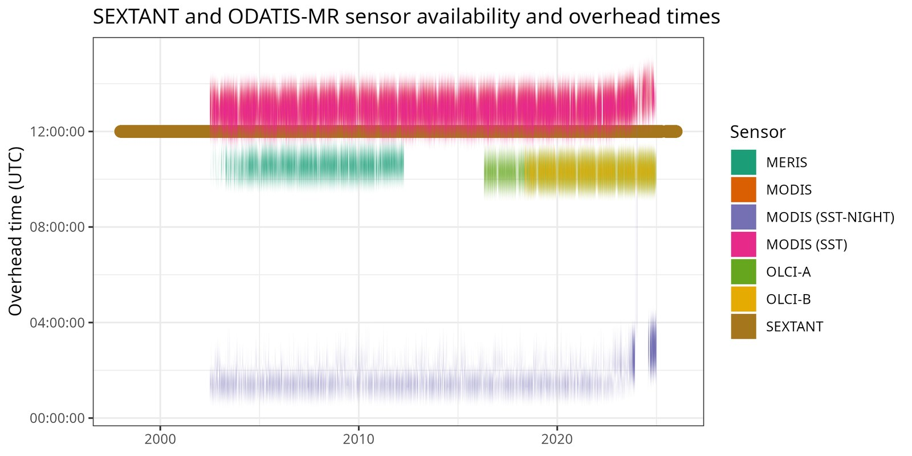

```{r setup}
#| include: false

# Required packages:
#   install.packages(c("readr", "dplyr", "tidyr", "reactable", "writexl",
#                      "plotly", "crosstalk", "htmltools", "scales"))

library(readr)
library(dplyr)
library(tidyr)
library(reactable)
library(writexl)
library(plotly)
library(crosstalk)
library(htmltools)
library(scales)

# "NA" is a real category in the `processing` column (meaning "no processing"),
# not a missing value, so we tell readr not to treat it as one.
df <- read_csv("table_all.csv", na = character(), show_col_types = FALSE) %>%
  select(-grid_size)

# With na = character(), readr cannot infer numeric types for columns that also
# contain "NA" strings (Bias, Error, Slope, Slope_log, RMSE, MSA, MAPE all do).
# Coerce them explicitly so summarise / mean() work correctly; "NA" strings
# become proper NA_real_ values.
df <- df %>%
  mutate(across(c(Slope, Slope_log, RMSE, MSA, MAPE, Bias, Error),
                ~suppressWarnings(as.numeric(.x))))

variable_levels <- c("CHLA", "SPM", "TEMP", "TUR")
variable_colors <- c(CHLA = "#e8f3d6", SPM = "#d8ecfb", TEMP = "#ffe5d6", TUR = "#f1e3ff")
season_levels   <- c("ALL", "Spring", "Summer", "Autumn", "Winter")

# Factor-encode categorical columns to keep level ordering consistent
# across plots and to enable droplevels() on subsets.
df <- df %>%
  mutate(
    sensor        = factor(sensor),
    correction    = factor(correction),
    processing    = factor(processing),
    zone          = factor(zone),
    source        = factor(source),
    season        = factor(season, levels = season_levels),
    variable      = factor(variable, levels = variable_levels),
    variable_sat  = factor(variable_sat)
  )

metric_cols <- c("n", "Bias", "Error", "Slope", "Slope_log")
display_cols <- c("sensor", "correction", "processing", "zone", "source",
                   "site", "season", "variable", "variable_sat", metric_cols)

# The broadest, cleanest rows in the dataset: one row per sensor / correction /
# processing / variable combination, pooled across all sources, sites, and
# seasons. This is the right granularity for summary bar charts -- mixing it
# with the season- or site-level rows would double count the same underlying
# matchups.
df_global <- df %>%
  filter(zone == "GLOBAL", source == "ALL", site == "ALL", season == "ALL") %>%
  droplevels() %>%
  mutate(
    corr_proc = paste0(as.character(correction), " / ", as.character(processing)),
    # Unique per-row label: sensor | correction / processing [variable_sat].
    # Used as the bar-chart x axis so every bar is independent (no stacking).
    bar_label = paste0(as.character(sensor), " | ", as.character(correction),
                       " / ", as.character(processing),
                       " [", as.character(variable_sat), "]")
  )

df_seasonal <- df %>%
  filter(site == "ALL", season != "ALL") %>%
  droplevels()

n_all      <- nrow(df)
n_overall  <- df %>% filter(zone == "GLOBAL", source == "ALL", site == "ALL", season == "ALL") %>% nrow()
n_seasonal <- df %>% filter(site == "ALL", season != "ALL") %>% nrow()
n_sites    <- df %>% filter(site != "ALL") %>% nrow()
n_sensors  <- dplyr::n_distinct(df$sensor)
n_site_ct  <- dplyr::n_distinct(df$site[df$site != "ALL"])

# htmltools pretty-prints nested tags with indentation, and indented lines
# read back through pandoc as a markdown code block (which escapes the tags
# instead of rendering them). Collapsing to a single line avoids that.
emit_html <- function(tag) cat(gsub("\n[ ]*", "", as.character(tag)))
```

```{=html}
<style>

:root {
  --bg: #f3f5f8;
  --card-bg: #ffffff;
  --card-border: #e4e8ef;
  --text: #232733;
  --text-muted: #5c6470;
  --accent: #2f7d77;
  --accent-dark: #235f5a;
  --accent-soft: #e4f2f0;
  --radius: 12px;
  --shadow: 0 1px 2px rgba(15,23,42,.06), 0 4px 14px rgba(15,23,42,.05);
}

body {
  background: var(--bg);
  color: var(--text);
  font-family: -apple-system, BlinkMacSystemFont, "Segoe UI", Roboto, Helvetica, Arial, sans-serif;
  line-height: 1.62;
}

h1, h2, h3, h4 { color: var(--text); font-weight: 650; }

a { color: var(--accent-dark); }
a:hover { color: var(--accent); }

/* narrower, centered framing instead of edge-to-edge */
body #quarto-document-content,
body .quarto-title-block,
body #quarto-margin-sidebar,
body .column-body,
body .column-page,
body .page-columns {
  max-width: 1220px !important;
  width: 100% !important;
  margin-left: auto !important;
  margin-right: auto !important;
  padding-left: 1.25rem !important;
  padding-right: 1.25rem !important;
}

body .page-columns {
  grid-template-columns: minmax(0, 1fr) 230px !important;
  column-gap: 2rem;
}

#quarto-margin-sidebar {
  grid-column: 2 !important;
  grid-row: 1 !important;
}

#quarto-document-content {
  grid-column: 1 !important;
  grid-row: 1 !important;
}

.quarto-title-block {
  padding-bottom: 1.25rem;
  margin-bottom: 0.5rem;
  border-bottom: 1px solid var(--card-border);
}

.quarto-title-block .subtitle {
  color: var(--text-muted);
}

/* every ## section becomes a card (pandoc wraps H2 sections in div.level2) */
.level2 {
  background: var(--card-bg);
  border: 1px solid var(--card-border);
  border-radius: var(--radius);
  box-shadow: var(--shadow);
  padding: 1.6rem 1.9rem;
  margin: 1.75rem 0;
}

.level2 > h2 {
  margin-top: 0;
  padding-bottom: 0.6rem;
  border-bottom: 2px solid var(--accent-soft);
}

.level2 h3 {
  color: var(--accent-dark);
}

img {
  border-radius: 8px;
  box-shadow: var(--shadow);
  border: 1px solid var(--card-border);
}

/* plain markdown tables (e.g. the metric-interpretation table) */
table:not(.dataTable) {
  border-collapse: collapse;
  width: 100%;
  margin: 1rem 0;
}

table:not(.dataTable) th,
table:not(.dataTable) td {
  border-bottom: 1px solid var(--card-border);
  padding: 0.5rem 0.7rem;
  text-align: left;
}

table:not(.dataTable) th {
  background: var(--accent-soft);
  color: var(--accent-dark);
}

.summary-grid {
  display: grid;
  grid-template-columns: repeat(auto-fit, minmax(170px, 1fr));
  gap: 0.85rem;
  margin: 1rem 0 0.25rem;
}

.summary-box {
  border: 1px solid var(--card-border);
  border-radius: 10px;
  padding: 0.85rem 1rem;
  background: var(--accent-soft);
}

.summary-label {
  display: block;
  color: var(--text-muted);
  font-size: 0.82rem;
  margin-bottom: 0.25rem;
}

.summary-value {
  font-size: 1.35rem;
  font-weight: 700;
  color: var(--accent-dark);
}

.variable-key {
  display: flex;
  flex-wrap: wrap;
  gap: 0.5rem;
  margin: 0.6rem 0 1rem;
}

.variable-chip {
  border: 1px solid var(--card-border);
  border-radius: 999px;
  padding: 0.3rem 0.85rem;
  font-size: 0.88rem;
  font-weight: 600;
}

.section-note {
  color: var(--text-muted);
  font-size: 0.92rem;
}

/* crosstalk filter widgets */
.crosstalk-input {
  margin-bottom: 0.9rem;
}

.crosstalk-input label {
  font-size: 0.82rem;
  color: var(--text-muted);
  font-weight: 600;
}

/* metric-switch buttons above the dashboard charts */
.dash-metric-btns { margin: 0.75rem 0 0.5rem; }
.dmb {
  background: #f3f3f3;
  border: 1px solid #c8c8c8;
  border-radius: 3px;
  padding: 0.3rem 0.9rem;
  font-size: 0.85rem;
  cursor: pointer;
  margin-right: 0.3rem;
  color: var(--text);
}
.dmb:hover { background: var(--accent-soft); }
.dmb.active {
  background: var(--accent);
  color: #fff;
  border-color: var(--accent-dark);
}

</style>
```

## Overview

This report explains the validation results of a comparison of **SEXTANT** and **ODATIS-MR expert** products against _in situ_ data measured by the [REPHY](https://www.seanoe.org/data/00361/47248/) and [SOMLIT](https://www.somlit.fr/en/) networks. The coordinates for the sites named in the tables below may be found via the REPHY and SOMLIT databases. Each row compares a satellite product against in situ observations for a specific sensor, correction, processing chain, zone, source, site, season, measured _in situ_ variable, and the corresponding satellite variable.

The data validated in this study were constrained to four of the French RiOMar, as seen below.

{width=80%}

The data from these stations were filtered to the dates and times when overhead satellite passes were available. For daytime values the time window was 10:00 to 14:00, and for nighttime values (SST only) this window was 00:00 to 09:00. Note that while 09:00 is a bit late into the morning, there were very few early morning measurements available for comparison otherwise.

The satellites used here have two different resolutions. **SEXTANT** is ~1 km, while **ODATIS-MR** is ~300 m. Therefore, for the **SEXTANT** data a 3x3 grid of pixels was extracted around each station, and for **ODATIS-MR** this was 7x7. In this way roughly a 1 km ring was extracted around each _in situ_ station for each matchup. Finally, the coefficient of variation (CV; standard deviation / mean; %) was computed across all extracted pixels and any days with a CV >20% were discarded. The resulting paired satellite and in situ observations were then compared using a variety of metrics, which are presented below.

{width=80%}

```{r summary-boxes}
#| results: asis

summary_grid <- div(class = "summary-grid",
  div(class = "summary-box", span(class = "summary-label", "Satellite Sensors"), div(class = "summary-value", comma(n_sensors))),
  div(class = "summary-box", span(class = "summary-label", "In situ Sites"), div(class = "summary-value", comma(n_site_ct))),
  div(class = "summary-box", span(class = "summary-label", "GLOBAL/ALL rows"), div(class = "summary-value", comma(n_overall))),
  div(class = "summary-box", span(class = "summary-label", "Seasonal rows"), div(class = "summary-value", comma(n_seasonal))),
  div(class = "summary-box", span(class = "summary-label", "Site-specific rows"), div(class = "summary-value", comma(n_sites))),
  div(class = "summary-box", span(class = "summary-label", "All result rows"), div(class = "summary-value", comma(n_all)))
)
emit_html(summary_grid)
```

The rows and charts below are colour coded by the _in situ_ variable used for the comparison:

```{r variable-key}
#| results: asis

chips <- lapply(variable_levels, function(v) {
  span(class = "variable-chip", style = paste0("background-color:", variable_colors[[v]], ";"), v)
})
emit_html(div(class = "variable-key", chips))
```

These are chlorophyll (CHLA), suspended particulate matter (SPM), temperature (TEMP), and turbidity (TUR), respectively.

## How to Read the Results

The results table further down lets you filter by sensor, correction, processing, zone, source, site, season, and variable using the boxes under each column header, and sort by clicking a column header. Rows are coloured by the `variable` column. The `Export` button above the table downloads the currently filtered rows as CSV or Excel.

| Metric | Interpretation |
|---|---|
| `n` | Number of paired satellite and in situ observations. |
| `Bias` | Mean signed difference. Positive or negative values show systematic over- or under-estimation. |
| `Error` | Mean unsigned percentage error. |
| `Slope` | Linear slope between satellite and in situ values. Values near 1 indicate proportional agreement. |
| `Slope_log` | Slope after log transformation of the data. Ideal for non-temperature data. |

## Scatterplots

Scatterplots for the GLOBAL results are available for every matchup shown in the summary dashboard below. These may be accessed via the GitHub interface directly within this [folder](https://github.com/RiOMar-projet/sat_access/tree/main/validation/scatterplot).

## Summary Dashboard

Sensors are compared on the x-axis; bars are coloured by variable. Each distinct correction / processing combination produces its own dodged bar, labelled above. Use the four filter boxes to select which sensors, corrections, processing chains, and variables to include; the **Bias / Error / Slope** buttons switch the metric shown. Click a variable in the legend to show or hide it.

```{r dashboard-setup}
#| include: false

# One row per (sensor, variable, correction, processing) combination.
# The one case where the same combo has two satellite variables (MODIS/NS/NA/TEMP:
# SST day vs night) is averaged so each position has at most one bar.
df_dash <- df_global %>%
  group_by(sensor, variable, correction, processing, corr_proc) %>%
  summarise(
    Bias  = mean(Bias,  na.rm = TRUE),
    Error = mean(Error, na.rm = TRUE),
    Slope = mean(Slope, na.rm = TRUE),
    .groups = "drop"
  ) %>%
  mutate(.key = paste0(as.character(variable), "_",
                       as.character(sensor), "_",
                       as.character(corr_proc)))

# Single SharedData that drives all four filter widgets and all three charts.
sd_full <- SharedData$new(df_dash, key = ~.key, group = "dash")

# Each unique (variable, corr_proc) pair becomes one dodged bar trace so
# different correction / processing combos sit side-by-side at each sensor.
trace_combos <- df_dash %>%
  select(variable, corr_proc) %>%
  distinct() %>%
  arrange(variable, corr_proc)

# Only the first trace per variable gets a legend entry; all share a legendgroup
# so clicking the variable label in the legend toggles all its traces at once.
vars_seen <- character(0)
show_leg  <- logical(nrow(trace_combos))
for (i in seq_len(nrow(trace_combos))) {
  v           <- as.character(trace_combos$variable[i])
  show_leg[i] <- !(v %in% vars_seen)
  vars_seen   <- union(vars_seen, v)
}

make_sensor_chart <- function(y_col, y_label, y_fmt = ".3f") {
  fig <- plot_ly()
  for (i in seq_len(nrow(trace_combos))) {
    v  <- as.character(trace_combos$variable[i])
    cp <- as.character(trace_combos$corr_proc[i])
    sub_df <- df_dash %>% filter(variable == v, corr_proc == cp)
    sd_sub <- SharedData$new(sub_df, key = ~.key, group = "dash")
    fig <- fig %>% add_trace(
      data          = sd_sub,
      type          = "bar",
      name          = v,
      legendgroup   = v,
      showlegend    = show_leg[i],
      x             = ~sensor,
      y             = as.formula(paste0("~", y_col)),
      marker        = list(color = variable_colors[[v]]),
      text          = cp,
      textposition  = "outside",
      textfont      = list(size = 8),
      hovertemplate = paste0(
        "<b>%{x}</b><br>",
        cp, "<br>",
        y_label, ": %{y:", y_fmt, "}",
        "<extra>", v, "</extra>"
      )
    )
  }
  fig %>%
    layout(
      barmode     = "group",
      yaxis       = list(title = y_label, type = "linear", rangemode = "tozero"),
      xaxis       = list(title = "", type = "category"),
      legend      = list(orientation = "h", y = -0.25,
                         title = list(text = "Variable (click to toggle)")),
      margin      = list(t = 40, b = 100),
      uniformtext = list(minsize = 6, mode = "hide")
    ) %>%
    config(displaylogo = FALSE)
}
```

```{r dashboard-filter}
bscols(
  widths = c(3, 3, 3, 3),
  filter_select("f-var-dash",  "Variable",   sd_full, ~variable),
  filter_select("f-sens-dash", "Sensor",     sd_full, ~sensor),
  filter_select("f-corr-dash", "Correction", sd_full, ~correction),
  filter_select("f-proc-dash", "Processing", sd_full, ~processing)
)
```

```{=html}
<div class="dash-metric-btns">
  <button class="dmb active" onclick="dashSwitch(this,'dash-bias')">Bias</button>
  <button class="dmb" onclick="dashSwitch(this,'dash-error')">Error (%)</button>
  <button class="dmb" onclick="dashSwitch(this,'dash-slope')">Slope</button>
</div>
<div id="dash-bias">
```

```{r dashboard-bias}
make_sensor_chart("Bias", "Bias", ".0f")
```

```{=html}
</div>
<div id="dash-error" style="display:none">
```

```{r dashboard-error}
make_sensor_chart("Error", "Error (%)", ".0f")
```

```{=html}
</div>
<div id="dash-slope" style="display:none">
```

```{r dashboard-slope}
make_sensor_chart("Slope", "Slope", ".2f")
```

```{=html}
</div>
<script>
function dashSwitch(btn, id) {
  ['dash-bias', 'dash-error', 'dash-slope'].forEach(function(x) {
    document.getElementById(x).style.display = (x === id ? 'block' : 'none');
  });
  document.querySelectorAll('.dash-metric-btns .dmb').forEach(function(b) {
    b.classList.remove('active');
  });
  btn.classList.add('active');
  // Resize the newly visible plotly chart (avoids blank-on-first-show).
  var pd = document.querySelector('#' + id + ' .plotly-graph-div');
  if (pd && window.Plotly) Plotly.Plots.resize(pd);
}
</script>
```

### Seasonal Summary

Distribution of Bias values by season (`site = ALL`). Linked to the dashboard filters above: selecting a sensor, correction, or processing combination updates this chart to show only matching matchups.

```{r seasonal-summary}
seasonal_linked <- df_seasonal %>%
  mutate(
    corr_proc = paste0(as.character(correction), " / ", as.character(processing)),
    .key      = paste0(as.character(variable), "_", as.character(sensor), "_", corr_proc),
    season    = factor(as.character(season), levels = c("Spring", "Summer", "Autumn", "Winter"))
  )
sd_seasonal <- SharedData$new(seasonal_linked, key = ~.key, group = "dash")

plot_ly(sd_seasonal,
        x = ~season, y = ~Bias, color = ~variable, colors = variable_colors,
        type = "box") %>%
  layout(
    boxmode = "group",
    yaxis   = list(title = "Bias", type = "linear", rangemode = "tozero"),
    xaxis   = list(title = "", type = "category",
                   categoryorder = "array",
                   categoryarray = c("Spring", "Summer", "Autumn", "Winter")),
    legend  = list(orientation = "h", y = -0.2),
    margin  = list(t = 10)
  ) %>%
  config(displaylogo = FALSE)
```

## Explore by Metric

Pick a metric and a grouping variable to explore the same GLOBAL/ALL summary rows from a different angle.

```{r explore-panel}
group_vars <- c("sensor", "correction", "processing", "variable")
metric_choices <- c("Bias", "Error", "Slope", "Slope_log")

combos <- expand.grid(metric = metric_choices, group = group_vars, stringsAsFactors = FALSE)

traces <- lapply(seq_len(nrow(combos)), function(i) {
  metric <- combos$metric[i]
  group  <- combos$group[i]
  agg <- df_global %>%
    group_by(.data[[group]]) %>%
    summarise(value = mean(.data[[metric]], na.rm = TRUE), .groups = "drop")
  list(
    x = as.character(agg[[group]]),
    y = agg$value,
    metric = metric,
    group = group,
    title = paste0("Mean ", metric, " by ", group)
  )
})

fig <- plot_ly()
for (i in seq_along(traces)) {
  tr <- traces[[i]]
  fig <- fig %>% add_bars(
    x = tr$x, y = tr$y,
    name = tr$title,
    marker = list(color = "#2f7d77"),
    visible = (i == 1)
  )
}

buttons <- lapply(seq_along(traces), function(i) {
  visible <- rep(FALSE, length(traces))
  visible[i] <- TRUE
  list(
    method = "update",
    args = list(
      list(visible = visible),
      list(title = traces[[i]]$title, "yaxis.title" = traces[[i]]$metric)
    ),
    label = traces[[i]]$title
  )
})

fig %>%
  layout(
    title = traces[[1]]$title,
    yaxis = list(title = traces[[1]]$metric),
    xaxis = list(title = ""),
    margin = list(t = 60),
    updatemenus = list(
      list(
        active = 0,
        x = 0, xanchor = "left",
        y = 1.18, yanchor = "top",
        buttons = buttons
      )
    )
  ) %>%
  config(displaylogo = FALSE)
```

## Results Table

All `r comma(n_all)` validation rows. The first three columns (sensor, corr., proc.) are pinned and remain visible while scrolling right — "corr." and "proc." are abbreviations for correction and processing. Categorical columns show tick-boxes; select any combination to filter by multiple values simultaneously. Metric columns (n, Bias, Error, Slope, Slope_log) show Min / Max numeric entry boxes; the site column accepts free text. Click any header to sort. The CSV button exports the currently filtered rows; the Excel button downloads the full dataset. Rows with empty metric values indicate that too few matchups existed for that sensor / site / season combination to compute reliable statistics. Rows are coloured by `variable`: <span class="variable-chip" style="background-color:#e8f3d6;">CHLA</span> <span class="variable-chip" style="background-color:#d8ecfb;">SPM</span> <span class="variable-chip" style="background-color:#ffe5d6;">TEMP</span> <span class="variable-chip" style="background-color:#f1e3ff;">TUR</span>.

```{r results-table}
tbl_data <- df[, display_cols]

# Pre-render Excel for the download button (full dataset, all rows).
tmp_xlsx <- tempfile(fileext = ".xlsx")
write_xlsx(tbl_data, tmp_xlsx)
xlsx_href <- paste0(
  "data:application/vnd.openxmlformats-officedocument.spreadsheetml.sheet;base64,",
  base64enc::base64encode(tmp_xlsx)
)
unlink(tmp_xlsx)

btn_style <- paste(
  "padding:0.3rem 0.9rem; font-size:0.85rem; cursor:pointer;",
  "background:#f3f3f3; border:1px solid #c8c8c8; border-radius:3px;",
  "text-decoration:none; color:inherit; display:inline-block; margin-right:0.4rem;"
)

dl_row <- div(
  style = "margin-bottom:0.6rem;",
  tags$button(
    "CSV (filtered rows)",
    style = btn_style,
    onclick = "Reactable.downloadDataCSV('results-tbl', 'validation_results.csv')"
  ),
  tags$a(
    "Excel (all rows)",
    href     = xlsx_href,
    download = "validation_results.xlsx",
    style    = btn_style
  )
)

# JS helper functions injected once alongside the reactable widget.
tbl_js <- tags$script(HTML('
function updateCheckFilter(tableId, columnId, containerId) {
  var c = document.getElementById(containerId);
  var checked = Array.from(c.querySelectorAll("input:checked"))
                     .map(function(el) { return el.value; });
  Reactable.setFilter(tableId, columnId, checked.length > 0 ? checked : undefined);
}
function updateRangeFilter(tableId, columnId, containerId) {
  var c     = document.getElementById(containerId);
  var loStr = c.querySelector(".rng-lo").value;
  var hiStr = c.querySelector(".rng-hi").value;
  var lo    = loStr === "" ? -Infinity : parseFloat(loStr);
  var hi    = hiStr === "" ?  Infinity : parseFloat(hiStr);
  if (isFinite(lo) && isFinite(hi) && lo > hi) { var tmp = lo; lo = hi; hi = tmp; }
  if (!isFinite(lo) && !isFinite(hi)) {
    Reactable.setFilter(tableId, columnId, undefined);
  } else {
    Reactable.setFilter(tableId, columnId, [lo, hi]);
  }
}
'))

# Filter method: row value must be in the ticked set.
check_filter <- JS("function(rows, columnId, filterValue) {
  if (!filterValue || filterValue.length === 0) return rows;
  return rows.filter(function(row) {
    return filterValue.indexOf(String(row.values[columnId])) !== -1;
  });
}")

# Filter method: row value must fall within [lo, hi].
range_filter <- JS("function(rows, columnId, filterValue) {
  if (!filterValue) return rows;
  return rows.filter(function(row) {
    var v = parseFloat(row.values[columnId]);
    return !isNaN(v) && v >= filterValue[0] && v <= filterValue[1];
  });
}")

# Scrollable checkbox list for categorical columns.
# Respects factor level ordering where available.
checkbox_input <- function(values, name) {
  opts <- if (is.factor(values)) {
    levels(values)[levels(values) %in% as.character(values)]
  } else {
    sort(unique(as.character(values[!is.na(values)])))
  }
  cid <- paste0("chk-", name)
  div(
    id    = cid,
    style = "max-height:100px; overflow-y:auto; padding:1px 0;",
    lapply(opts, function(v) {
      tags$label(
        style = "display:block; white-space:nowrap; font-size:0.78rem; cursor:pointer;",
        tags$input(
          type     = "checkbox",
          value    = v,
          style    = "margin-right:4px; vertical-align:middle;",
          onchange = sprintf("updateCheckFilter('results-tbl','%s','%s')", name, cid)
        ),
        v
      )
    })
  )
}

# Dual Min / Max numeric entry boxes for numeric columns.
range_input <- function(values, name, digits = 0) {
  vals <- suppressWarnings(as.numeric(values))
  lo   <- floor(min(vals, na.rm = TRUE))
  hi   <- ceiling(max(vals, na.rm = TRUE))
  step <- if (digits > 0) 10^(-digits) else 1
  cid  <- paste0("rng-", name)
  inp_style <- "width:100%; font-size:0.78rem; padding:1px 3px; box-sizing:border-box;"
  div(
    id    = cid,
    style = "padding:2px 0; font-size:0.78rem; color:#555; line-height:1.6;",
    "Min",
    tags$input(
      type        = "number", class = "rng-lo",
      placeholder = lo, min = lo, max = hi, step = step,
      style    = inp_style,
      onchange = sprintf("updateRangeFilter('results-tbl','%s','%s')", name, cid)
    ),
    "Max",
    tags$input(
      type        = "number", class = "rng-hi",
      placeholder = hi, min = lo, max = hi, step = step,
      style    = inp_style,
      onchange = sprintf("updateRangeFilter('results-tbl','%s','%s')", name, cid)
    )
  )
}

tbl <- reactable(
  tbl_data,
  elementId       = "results-tbl",
  filterable      = TRUE,
  searchable      = TRUE,
  defaultPageSize = 10,
  pageSizeOptions = c(10, 25, 50, 100),
  highlight       = TRUE,
  compact         = TRUE,
  style           = list(fontSize = "0.85rem"),
  rowStyle = function(index) {
    v <- as.character(tbl_data$variable[index])
    list(background = variable_colors[[v]])
  },
  columns = list(
    sensor = colDef(
      sticky = "left", minWidth = 80,
      filterMethod = check_filter, filterInput = checkbox_input
    ),
    correction = colDef(
      name = "corr.", sticky = "left", minWidth = 65,
      filterMethod = check_filter, filterInput = checkbox_input
    ),
    processing = colDef(
      name = "proc.", sticky = "left", minWidth = 65,
      filterMethod = check_filter, filterInput = checkbox_input
    ),
    zone = colDef(
      minWidth = 75,
      filterMethod = check_filter, filterInput = checkbox_input
    ),
    source = colDef(
      minWidth = 70,
      filterMethod = check_filter, filterInput = checkbox_input
    ),
    site         = colDef(minWidth = 130),
    season = colDef(
      minWidth = 80,
      filterMethod = check_filter, filterInput = checkbox_input
    ),
    variable = colDef(
      minWidth = 75,
      filterMethod = check_filter, filterInput = checkbox_input
    ),
    variable_sat = colDef(
      name = "var (sat)", minWidth = 85,
      filterMethod = check_filter, filterInput = checkbox_input
    ),
    n = colDef(
      minWidth     = 60,
      format       = colFormat(separators = TRUE, digits = 0),
      filterMethod = range_filter,
      filterInput  = function(values, name) range_input(values, name, digits = 0)
    ),
    Bias = colDef(
      minWidth     = 65,
      format       = colFormat(digits = 0),
      filterMethod = range_filter,
      filterInput  = function(values, name) range_input(values, name, digits = 0)
    ),
    Error = colDef(
      minWidth     = 65,
      format       = colFormat(digits = 0),
      filterMethod = range_filter,
      filterInput  = function(values, name) range_input(values, name, digits = 0)
    ),
    Slope = colDef(
      minWidth     = 65,
      format       = colFormat(digits = 2),
      filterMethod = range_filter,
      filterInput  = function(values, name) range_input(values, name, digits = 2)
    ),
    Slope_log = colDef(
      minWidth     = 70,
      format       = colFormat(digits = 2),
      filterMethod = range_filter,
      filterInput  = function(values, name) range_input(values, name, digits = 2)
    )
  )
)

tagList(dl_row, tbl, tbl_js)
```