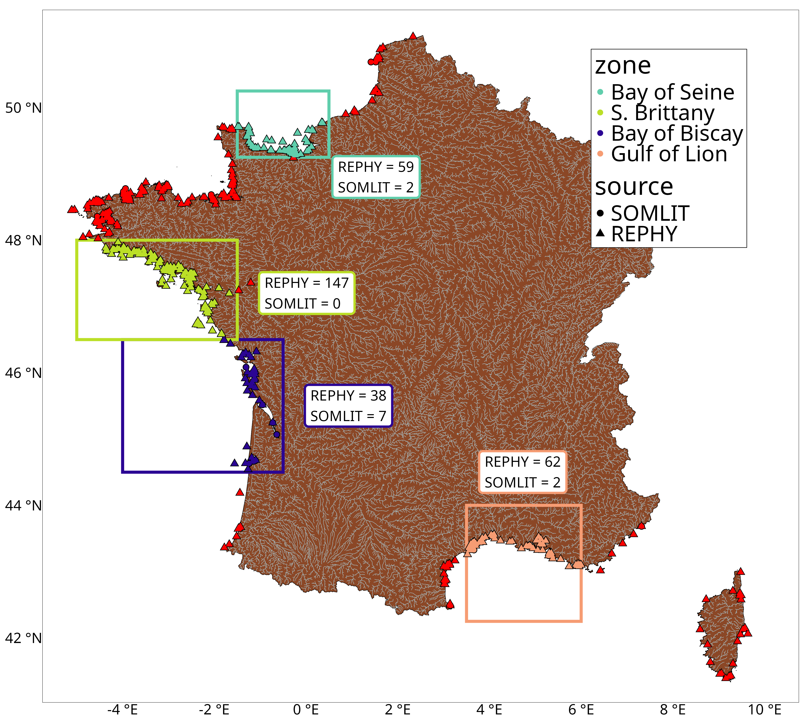

```{=html}

<style>

.summary-grid {
  display: grid;
  grid-template-columns: repeat(auto-fit, minmax(180px, 1fr));
  gap: 0.75rem;
  margin: 1rem 0 1.5rem;
}

.summary-box {
  border: 1px solid #d9dee7;
  border-radius: 6px;
  padding: 0.8rem 0.95rem;
  background: #f8fafc;
}

.summary-label {
  display: block;
  color: #596579;
  font-size: 0.85rem;
  margin-bottom: 0.25rem;
}

.variable-key,
.table-toolbar,
.pager {
  display: flex;
  flex-wrap: wrap;
  gap: 0.5rem;
  align-items: center;
}

.variable-key {
  margin: 0.6rem 0 1.2rem;
}

.variable-chip {
  border: 1px solid #cbd5e1;
  border-radius: 6px;
  padding: 0.25rem 0.5rem;
  font-size: 0.9rem;
}

.result-table {
  margin: 1rem 0 1.5rem;
}

.table-caption {
  font-weight: 600;
  margin-bottom: 0.5rem;
}

.table-toolbar {
  border: 1px solid #d9dee7;
  border-radius: 6px;
  padding: 0.65rem;
  background: #f8fafc;
  margin-bottom: 0.6rem;
}

.table-toolbar label {
  display: grid;
  gap: 0.15rem;
  font-size: 0.78rem;
  color: #596579;
}

.table-toolbar input,
.table-toolbar select {
  min-width: 8.5rem;
  border: 1px solid #cbd5e1;
  border-radius: 5px;
  padding: 0.28rem 0.4rem;
  font-size: 0.85rem;
  background: white;
}

.table-toolbar button,
.pager button {
  border: 1px solid #b8c2d2;
  border-radius: 5px;
  background: white;
  padding: 0.32rem 0.55rem;
  font-size: 0.85rem;
  cursor: pointer;
}

.table-toolbar button:hover,
.pager button:hover {
  background: #eef2f7;
}

.table-scroll {
  overflow-x: auto;
  border: 1px solid #d9dee7;
  border-radius: 6px;
}

table.interactive-results {
  width: 100%;
  min-width: 1200px;
  border-collapse: collapse;
  font-size: 0.86rem;
}

table.interactive-results th,
table.interactive-results td {
  border-bottom: 1px solid #e6ebf2;
  padding: 0.36rem 0.45rem;
  white-space: nowrap;
}

table.interactive-results th {
  position: sticky;
  top: 0;
  z-index: 1;
  background: #eef2f7;
  color: #253044;
  cursor: pointer;
  user-select: none;
}

table.interactive-results tbody tr:hover td {
  filter: brightness(0.97);
}

.pager {
  justify-content: space-between;
  margin-top: 0.55rem;
  color: #596579;
  font-size: 0.88rem;
}

.empty-note {
  color: #596579;
  font-style: italic;
}

body #quarto-document-content,
body .quarto-title-block,
body #quarto-margin-sidebar,
body .column-body,
body .column-page,
body .page-columns {
  max-width: 100% !important;
  width: 100% !important;
  padding-left: 1rem !important;
  padding-right: 1rem !important;
}

body .page-columns {
  grid-template-columns: 1fr 250px !important;
}

#quarto-margin-sidebar {
  grid-column: 2 !important;
  grid-row: 1 !important;
}

#quarto-document-content {
  grid-column: 1 !important;
  grid-row: 1 !important;
}

</style>
```

This report explains the validation results of a comparison of **SEXTANT** and **ODATIS-MR expert** products against _in situ_ data measured by the [REPHY](https://www.seanoe.org/data/00361/47248/) and [SOMLIT](https://www.somlit.fr/en/) networks. Each row compares a satellite product against in situ observations for a specific sensor, correction, processing chain, zone, source, site, season, measured _in situ_ variable, and the corresponding satellite variable.

The data validated in this study were constrained to four of the French RiOMar, as seen below.

{width=80%}

The data from these stations were filtered to the dates and times when overhead satellite passes were available. For daytime values the time window was 10:00 to 14:00, and for nighttime values (SST only) this window was 00:00 to 09:00. Note that while 09:00 is a bit late into the morning, there were very few early morning measurements available for comparison otherwise. 

The satellites used here have two different resolutoins. **SEXTANT** is ~1 km, while **ODATIS-MR** is ~ 300 m. Therefore, for the **SEXTANT** data a 3x3 grid of pixels was extracted around each station, and for **ODATIS-MR** this was 7x7. In this way roughly a 1 km ring was extracted around each _in situ_ station for each matchup. Finally, the coefficient of variation (CV; standard deviation/ mean; %) was computed across all extracted pixels and any days with a CV >20% were discarded. The resulting paired satellite and in situ observations were then compared using a variety of metrics, which are presented in the tables below.

{width=80%}

The broadest rows are presented first: `GLOBAL` zone, `ALL` source, `ALL` site, and `ALL` season. The document then moves into larger seasonal tables and finishes with the full site-level results.

The row counts at a glance:

<div class="summary-grid">
  <div class="summary-box"><span class="summary-label">All result rows</span><strong data-count="all">...</strong></div>
  <div class="summary-box"><span class="summary-label">Broad GLOBAL/ALL rows</span><strong data-count="overall">...</strong></div>
  <div class="summary-box"><span class="summary-label">Seasonal rows, site = ALL</span><strong data-count="seasonal">...</strong></div>
  <div class="summary-box"><span class="summary-label">Site-specific rows</span><strong data-count="sites">...</strong></div>
  <div class="summary-box"><span class="summary-label">Sensors</span><strong data-count="sensors">...</strong></div>
  <div class="summary-box"><span class="summary-label">Sites, excluding ALL</span><strong data-count="site-count">...</strong></div>
</div>

The rows below are colour coded by the _in situ_ variables used for the comparisons:

<div class="variable-key">
  <span class="variable-chip" style="background-color:#e8f3d6;">CHLA</span>
  <span class="variable-chip" style="background-color:#d8ecfb;">SPM</span>
  <span class="variable-chip" style="background-color:#ffe5d6;">TEMP</span>
  <span class="variable-chip" style="background-color:#f1e3ff;">TUR</span>
</div>

These are chlorophyll, suspended particulate matter, temperature, and turbidity, respectively.

## How to Read the Tables

Use the filters above each table to narrow by sensor, correction, processing, zone, source, site, season, or variable. Click column headers to sort. The CSV button downloads the currently filtered rows for that table. Rows are colored by the `variable` column so chlorophyll, suspended particulate matter, temperature, and turbidity comparisons remain easy to distinguish while scanning.

| Metric | Interpretation |
|---|---|
| `n` | Number of paired satellite and in situ observations. |
| `Bias` | Mean signed difference. Positive or negative values show systematic over- or under-estimation. |
| `Error` | Mean unsigned percentage error. |
| `Slope` | Linear slope between satellite and in situ values. Values near 1 indicate proportional agreement. |
| `Slope_log` | Slope after log transformation of the data. Ideal for non-temperature data. |
<!-- | `RMSE` | Root mean squared error. Smaller values indicate lower absolute error. | -->
<!-- | `MSA` | Multiplicative symmetric accuracy. Values closer to 1 indicate better agreement. | -->
<!-- | `MAPE` | Mean absolute percentage error. Smaller values indicate lower relative error. | -->

## Scatterplots

Scatterplots for the GLOBAL results are also available for every matchup shown in the first table below. These may be accessed via the GitHub interface directly within this folder.

## GLOBAL and ALL Results

These tabs start with the broadest possible summary rows and then open into the next-most-general summaries by source and by zone.

::: {.panel-tabset}

### Overall GLOBAL/ALL

`GLOBAL` zone, `ALL` source, `ALL` site, and `ALL` season. This is the best first stop for comparing sensors and processing choices at the most general level.

<div class="result-table" data-slice="overall" data-caption="GLOBAL zone, ALL source, ALL site, ALL season"></div>

### GLOBAL by Source

`GLOBAL` zone with `ALL` site and `ALL` season, retaining source-specific rows. Use this to see whether the broad results differ between the full source pool and individual in situ networks.

<div class="result-table" data-slice="global-source" data-caption="GLOBAL zone by source, with ALL site and ALL season"></div>

### ALL Source by Zone

`ALL` source, `ALL` site, and `ALL` season, retaining zone-specific rows. Use this to compare broad regional behavior before moving into seasons and sites.

<div class="result-table" data-slice="zone-all" data-caption="ALL source by zone, with ALL site and ALL season"></div>

:::

## GLOBAL/ALL by Variable

The same broad `GLOBAL` and `ALL` rows are split by variable here. This is useful to look at only one type of water-colour or temperature product.

::: {.panel-tabset}

### CHLA

<div class="result-table" data-slice="overall" data-variable="CHLA" data-caption="GLOBAL/ALL results for CHLA"></div>

### SPM

<div class="result-table" data-slice="overall" data-variable="SPM" data-caption="GLOBAL/ALL results for SPM"></div>

### TEMP

<div class="result-table" data-slice="overall" data-variable="TEMP" data-caption="GLOBAL/ALL results for TEMP"></div>

### TUR

<div class="result-table" data-slice="overall" data-variable="TUR" data-caption="GLOBAL/ALL results for TUR"></div>

:::

## Seasonal Results

The seasonal tables keep `site == "ALL"` and show season-specific rows. They are larger than the global overview because they retain the seasonal split while still avoiding individual-site detail.

::: {.panel-tabset}

### Spring

<div class="result-table" data-slice="season" data-season="Spring" data-caption="Seasonal results for Spring with site = ALL" data-page-size="50"></div>

### Summer

<div class="result-table" data-slice="season" data-season="Summer" data-caption="Seasonal results for Summer with site = ALL" data-page-size="50"></div>

### Autumn

<div class="result-table" data-slice="season" data-season="Autumn" data-caption="Seasonal results for Autumn with site = ALL" data-page-size="50"></div>

### Winter

<div class="result-table" data-slice="season" data-season="Winter" data-caption="Seasonal results for Winter with site = ALL" data-page-size="50"></div>

:::

## Seasonal Results by Variable

This section keeps the seasonal rows but separates them by `variable`, which makes it easier to compare seasonal behavior within one measurement type.

::: {.panel-tabset}

### CHLA

<div class="result-table" data-slice="seasonal-variable" data-variable="CHLA" data-caption="All seasonal rows for CHLA" data-page-size="50"></div>

### SPM

<div class="result-table" data-slice="seasonal-variable" data-variable="SPM" data-caption="All seasonal rows for SPM" data-page-size="50"></div>

### TEMP

<div class="result-table" data-slice="seasonal-variable" data-variable="TEMP" data-caption="All seasonal rows for TEMP" data-page-size="50"></div>

### TUR

<div class="result-table" data-slice="seasonal-variable" data-variable="TUR" data-caption="All seasonal rows for TUR" data-page-size="50"></div>

:::

## Site-Level Results

This final section contains the most detailed rows, where `site` is not `ALL`. These tables are intentionally large and are best explored with the column filters.

::: {.panel-tabset}

### All Sites

<div class="result-table" data-slice="sites" data-caption="All site-specific validation rows" data-page-size="50"></div>

### CHLA

<div class="result-table" data-slice="site-variable" data-variable="CHLA" data-caption="Site-specific rows for CHLA" data-page-size="50"></div>

### SPM

<div class="result-table" data-slice="site-variable" data-variable="SPM" data-caption="Site-specific rows for SPM" data-page-size="50"></div>

### TEMP

<div class="result-table" data-slice="site-variable" data-variable="TEMP" data-caption="Site-specific rows for TEMP" data-page-size="50"></div>

### TUR

<div class="result-table" data-slice="site-variable" data-variable="TUR" data-caption="Site-specific rows for TUR" data-page-size="50"></div>

:::

```{=html}
<script>
(function () {
  const csvCandidates = ["table_all.csv", "validation/table_all.csv"];
  const keyColumns = ["sensor", "correction", "processing", "grid_size", "zone", "source", "site", "season", "variable", "variable_sat"];
  //const preferredMetricColumns = ["n", "Slope", "Slope_log", "RMSE", "MSA", "MAPE", "Bias", "Error"];
  const preferredMetricColumns = ["n", "Bias", "Error", "Slope", "Slope_log"];
  const variableColors = { CHLA: "#e8f3d6", SPM: "#d8ecfb", TEMP: "#ffe5d6", TUR: "#f1e3ff" };
  const numericColumns = new Set(preferredMetricColumns);
  const defaultFilterColumns = ["sensor", "correction", "processing", "grid_size", "zone", "source", "site", "season", "variable"];

  function parseCsv(text) {
    const rows = [];
    let row = [];
    let value = "";
    let inQuotes = false;
    for (let i = 0; i < text.length; i += 1) {
      const char = text[i];
      const next = text[i + 1];
      if (char === '"' && inQuotes && next === '"') {
        value += '"';
        i += 1;
      } else if (char === '"') {
        inQuotes = !inQuotes;
      } else if (char === "," && !inQuotes) {
        row.push(value);
        value = "";
      } else if ((char === "\n" || char === "\r") && !inQuotes) {
        if (char === "\r" && next === "\n") i += 1;
        row.push(value);
        if (row.some((cell) => cell !== "")) rows.push(row);
        row = [];
        value = "";
      } else {
        value += char;
      }
    }
    if (value !== "" || row.length > 0) {
      row.push(value);
      rows.push(row);
    }
    const headers = rows.shift();
    return rows.map((cells) => Object.fromEntries(headers.map((header, index) => [header, cells[index] || ""])));
  }

  async function loadCsv() {
    const errors = [];
    for (const path of csvCandidates) {
      try {
        const response = await fetch(path);
        if (response.ok) return parseCsv(await response.text());
        errors.push(path + " returned " + response.status);
      } catch (error) {
        errors.push(path + " failed: " + error.message);
      }
    }
    throw new Error(errors.join("; "));
  }

  function orderedColumns(rows) {
    const seen = new Set(rows.flatMap((row) => Object.keys(row)));
    const preferred = [...keyColumns, ...preferredMetricColumns].filter((column) => seen.has(column));
    // const rest = [...seen].filter((column) => !preferred.includes(column));
    return [...preferred]//, ...rest];
  }

  function sliceRows(rows, mount) {
    const slice = mount.dataset.slice;
    const variable = mount.dataset.variable;
    const season = mount.dataset.season;
    return rows.filter((row) => {
      if (variable && row.variable !== variable) return false;
      if (season && row.season !== season) return false;
      if (slice === "overall") return row.zone === "GLOBAL" && row.source === "ALL" && row.site === "ALL" && row.season === "ALL";
      if (slice === "global-source") return row.zone === "GLOBAL" && row.site === "ALL" && row.season === "ALL";
      if (slice === "zone-all") return row.source === "ALL" && row.site === "ALL" && row.season === "ALL";
      if (slice === "season") return row.site === "ALL" && row.season !== "ALL";
      if (slice === "seasonal-variable") return row.site === "ALL" && row.season !== "ALL";
      if (slice === "sites") return row.site !== "ALL";
      if (slice === "site-variable") return row.site !== "ALL";
      return true;
    });
  }

  function uniqueSorted(rows, column) {
    return [...new Set(rows.map((row) => row[column]).filter(Boolean))].sort((a, b) => a.localeCompare(b));
  }

  function escapeHtml(value) {
    return String(value ?? "").replaceAll("&", "&amp;").replaceAll("<", "&lt;").replaceAll(">", "&gt;").replaceAll('"', "&quot;").replaceAll("'", "&#039;");
  }

  function formatCell(column, value) {
    if (!numericColumns.has(column) || value === "") return escapeHtml(value);
    const number = Number(value);
    if (!Number.isFinite(number)) return escapeHtml(value);
    if (column === "n") return number.toLocaleString();
    return number.toLocaleString(undefined, { maximumFractionDigits: 3 });
  }

  function csvEscape(value) {
    const stringValue = String(value ?? "");
    if (/[",\n\r]/.test(stringValue)) return '"' + stringValue.replaceAll('"', '""') + '"';
    return stringValue;
  }

  function downloadCsv(rows, columns, caption) {
    const csv = [columns.map(csvEscape).join(","), ...rows.map((row) => columns.map((column) => csvEscape(row[column])).join(","))].join("\n");
    const blob = new Blob([csv], { type: "text/csv;charset=utf-8" });
    const url = URL.createObjectURL(blob);
    const link = document.createElement("a");
    link.href = url;
    link.download = caption.toLowerCase().replace(/[^a-z0-9]+/g, "-").replace(/^-|-$/g, "") + ".csv";
    document.body.appendChild(link);
    link.click();
    link.remove();
    URL.revokeObjectURL(url);
  }

  function createInteractiveTable(mount, sourceRows) {
    const rows = sliceRows(sourceRows, mount);
    const caption = mount.dataset.caption || "Validation results";
    const columns = orderedColumns(rows.length > 0 ? rows : sourceRows);
    const pageSize = Number(mount.dataset.pageSize || 25);
    const state = { search: "", filters: {}, sortColumn: "variable", sortDirection: "asc", page: 1 };
    if (rows.length === 0) {
      mount.innerHTML = '<p class="empty-note">No rows are available for this selection.</p>';
      return;
    }

    mount.innerHTML = "";
    const captionEl = document.createElement("div");
    captionEl.className = "table-caption";
    captionEl.textContent = caption;
    const toolbar = document.createElement("div");
    toolbar.className = "table-toolbar";
    const searchLabel = document.createElement("label");
    searchLabel.textContent = "Search";
    const searchInput = document.createElement("input");
    searchInput.type = "search";
    searchInput.placeholder = "Any column";
    searchInput.addEventListener("input", () => { state.search = searchInput.value.toLowerCase(); state.page = 1; render(); });
    searchLabel.appendChild(searchInput);
    toolbar.appendChild(searchLabel);

    defaultFilterColumns.filter((column) => columns.includes(column)).forEach((column) => {
      const values = uniqueSorted(rows, column);
      if (values.length <= 1) return;
      const label = document.createElement("label");
      label.textContent = column;
      const select = document.createElement("select");
      select.innerHTML = '<option value="">All</option>' + values.map((value) => `<option value="${escapeHtml(value)}">${escapeHtml(value)}</option>`).join("");
      select.addEventListener("change", () => { state.filters[column] = select.value; state.page = 1; render(); });
      label.appendChild(select);
      toolbar.appendChild(label);
    });

    const exportButton = document.createElement("button");
    exportButton.type = "button";
    exportButton.textContent = "CSV";
    exportButton.addEventListener("click", () => downloadCsv(filteredRows(), columns, caption));
    toolbar.appendChild(exportButton);
    const scroll = document.createElement("div");
    scroll.className = "table-scroll";
    const table = document.createElement("table");
    table.className = "interactive-results";
    scroll.appendChild(table);
    const pager = document.createElement("div");
    pager.className = "pager";
    const pagerInfo = document.createElement("span");
    const pagerControls = document.createElement("span");
    const prevButton = document.createElement("button");
    prevButton.type = "button";
    prevButton.textContent = "Previous";
    const nextButton = document.createElement("button");
    nextButton.type = "button";
    nextButton.textContent = "Next";
    prevButton.addEventListener("click", () => { state.page = Math.max(1, state.page - 1); render(); });
    nextButton.addEventListener("click", () => { state.page += 1; render(); });
    pagerControls.append(prevButton, nextButton);
    pager.append(pagerInfo, pagerControls);
    mount.append(captionEl, toolbar, scroll, pager);

    function filteredRows() {
      return rows.filter((row) => {
        const matchesSearch = !state.search || columns.some((column) => String(row[column] || "").toLowerCase().includes(state.search));
        if (!matchesSearch) return false;
        return Object.entries(state.filters).every(([column, value]) => !value || row[column] === value);
      }).sort((a, b) => {
        const leftRaw = a[state.sortColumn] ?? "";
        const rightRaw = b[state.sortColumn] ?? "";
        const leftNumber = Number(leftRaw);
        const rightNumber = Number(rightRaw);
        let comparison;
        if (Number.isFinite(leftNumber) && Number.isFinite(rightNumber) && leftRaw !== "" && rightRaw !== "") comparison = leftNumber - rightNumber;
        else comparison = String(leftRaw).localeCompare(String(rightRaw));
        return state.sortDirection === "asc" ? comparison : -comparison;
      });
    }

    function render() {
      const filtered = filteredRows();
      const pageCount = Math.max(1, Math.ceil(filtered.length / pageSize));
      state.page = Math.min(state.page, pageCount);
      const start = (state.page - 1) * pageSize;
      const visibleRows = filtered.slice(start, start + pageSize);
      const thead = "<thead><tr>" + columns.map((column) => {
        const marker = state.sortColumn === column ? (state.sortDirection === "asc" ? " ^" : " v") : "";
        return `<th data-column="${escapeHtml(column)}">${escapeHtml(column)}${marker}</th>`;
      }).join("") + "</tr></thead>";
      const tbody = "<tbody>" + visibleRows.map((row) => {
        const color = variableColors[row.variable] || "#ffffff";
        const cells = columns.map((column) => `<td>${formatCell(column, row[column] ?? "")}</td>`).join("");
        return `<tr style="background-color:${color};">${cells}</tr>`;
      }).join("") + "</tbody>";
      table.innerHTML = thead + tbody;
      table.querySelectorAll("th").forEach((th) => {
        th.addEventListener("click", () => {
          const column = th.dataset.column;
          if (state.sortColumn === column) state.sortDirection = state.sortDirection === "asc" ? "desc" : "asc";
          else { state.sortColumn = column; state.sortDirection = "asc"; }
          render();
        });
      });
      const end = Math.min(start + pageSize, filtered.length);
      pagerInfo.textContent = `${filtered.length.toLocaleString()} rows; showing ${filtered.length === 0 ? 0 : start + 1}-${end}`;
      prevButton.disabled = state.page <= 1;
      nextButton.disabled = state.page >= pageCount;
    }
    render();
  }

  function setCount(name, value) {
    document.querySelectorAll(`[data-count="${name}"]`).forEach((element) => { element.textContent = Number(value).toLocaleString(); });
  }

  function fillSummary(rows) {
    const overall = rows.filter((row) => row.zone === "GLOBAL" && row.source === "ALL" && row.site === "ALL" && row.season === "ALL");
    const seasonal = rows.filter((row) => row.site === "ALL" && row.season !== "ALL");
    const sites = rows.filter((row) => row.site !== "ALL");
    setCount("all", rows.length);
    setCount("overall", overall.length);
    setCount("seasonal", seasonal.length);
    setCount("sites", sites.length);
    setCount("sensors", new Set(rows.map((row) => row.sensor)).size);
    setCount("site-count", new Set(sites.map((row) => row.site)).size);
  }

  document.addEventListener("DOMContentLoaded", async () => {
    try {
      const rows = await loadCsv();
      fillSummary(rows);
      document.querySelectorAll(".result-table").forEach((mount) => createInteractiveTable(mount, rows));
    } catch (error) {
      document.querySelectorAll(".result-table").forEach((mount) => {
        mount.innerHTML = `<p class="empty-note">Could not load table_all.csv: ${escapeHtml(error.message)}</p>`;
      });
    }
  });
})();
</script>
```
